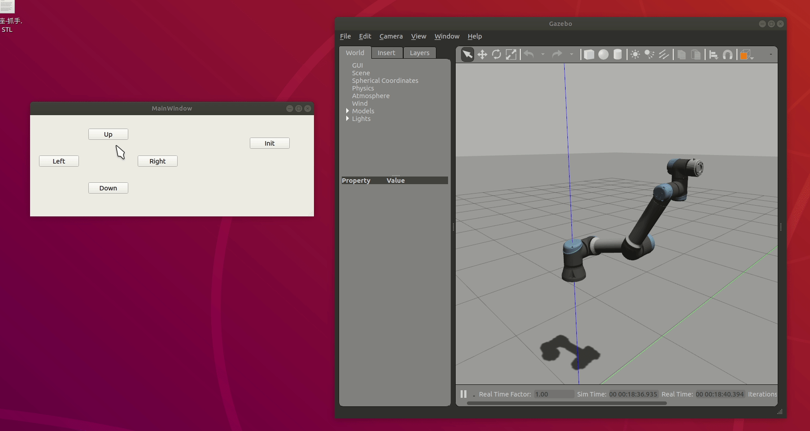

# ARM CONTROL GUI

This is a demo that written a Graphic User Interface(GUI) in ROS. The GUI is a Qt based framework. 

:warning: :warning: :warning:WARNING!!! CODE IS NOT CLEAN UP, POOR WRITTEN~

## Dependencies

- Qt
- MoveIt!
- trac_ik
- MoveIt Visual Tools
- ur_test package

## Usage

```bash
# launch ur5e, add sim:=true if you want Gazebo Sim
roslaunch ur_test ur_bringup.launch [sim:=true]
# launch MoveIt!
roslaunch ur_test moveit_bringup.launch [sim:=true]
# launch arm_control_gui
rosrun arm_control_gui arm_control_gui_node
```


## Snapshot

