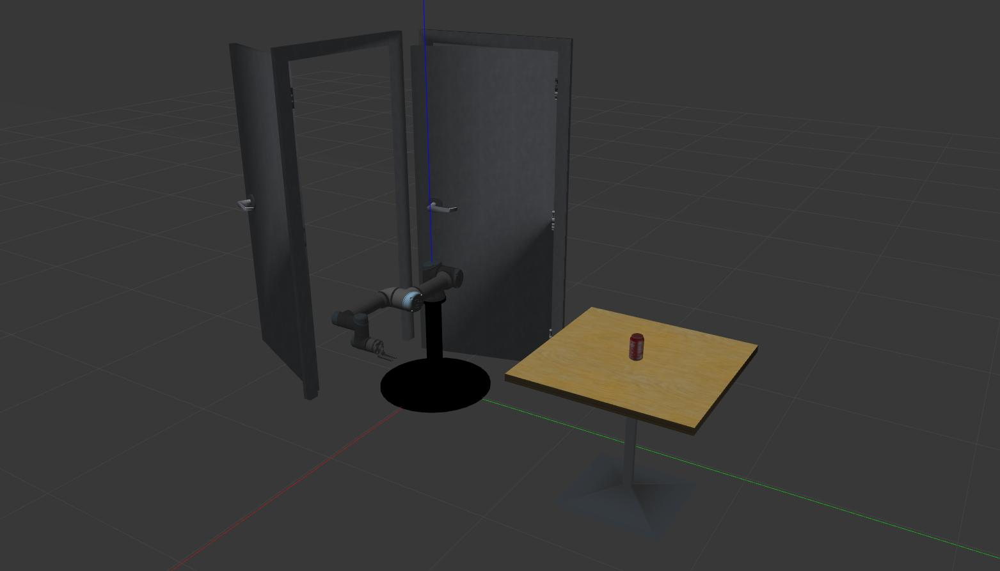

# UR5e Open Door Demo

This is the demo of open door with Universal Robot e-series in Gazebo simulation.

## Dependencies

This demo is tested in ROS melodic with Ubuntu 18.04 LTS. The demo depends on the following packages:

- [ros-industrial/*universal*_*robot*](https://github.com/ros-industrial/universal_robot)


## File Structure

- `src/`source files
- `config`some configuration files used by Rviz or ROS Control.
- `launch`launch files
- `meshes` 3D model files, such as *.STL or *.dae
- `worlds`SDF file used in Gazebo

## Usage

1. clone the demo into the catkin workspace and go into the workspace

```bash
$ cd ur_ws/
```

2. build the workspace

```bash
$ catkin build
```

3. source setup file

```bash
$ source devel/setup.bash
```

4. launch the Gazebo Simulation

```bash
$ roslaunch ur5e_open_door_demo ur5e_open_door_gazebo.launch
```


## Snapshots

